# MindMap

This is a project where I test my skills on Electron, Vue and Node. It is a copy of the popular text editor Obsidian and integrates the WYSWYG functionality. It offers all the basic necessities for a text editor. You can also set 3 types of objects. Concept, relations, and tags.

## Vault System

### Current

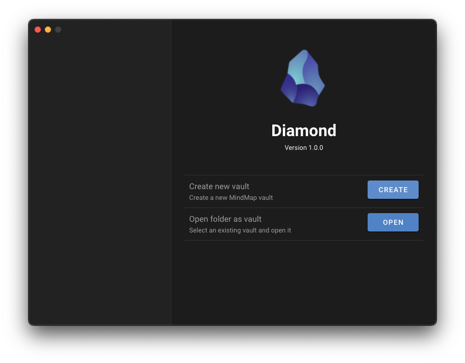

Here you decide to create a new "vault" (folder with all your .json and .md)

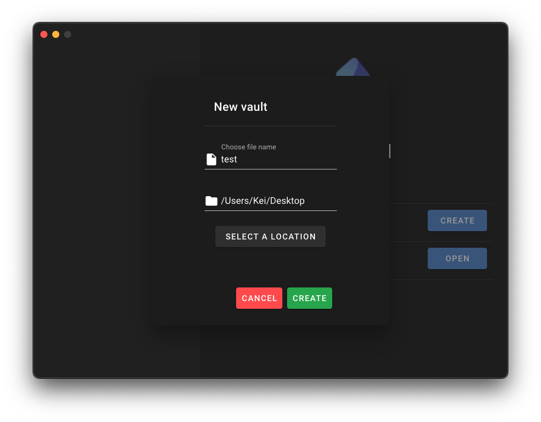Open a folder as "vault"
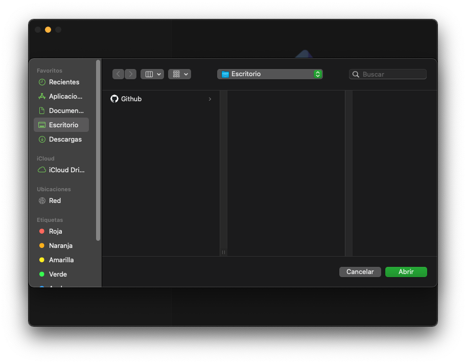

Or simply open a previously opened vault

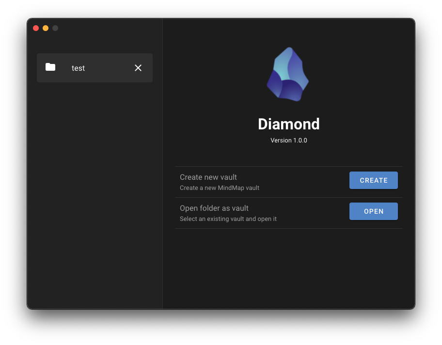

### Future

This in the future will be synced maybe with Google or GitHub, providing the possibility of
sharing your DataBase more easily.

## TitleBar

### Current

Here is a custom TitleBar with our design, where you have the default buttons aswell as a container for tabs.

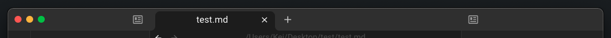

You create new tabs (files) and close them.

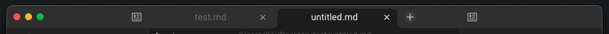
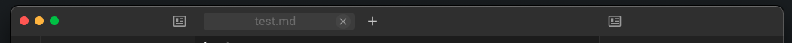

You can also toggle the sidebars for a more clean view.

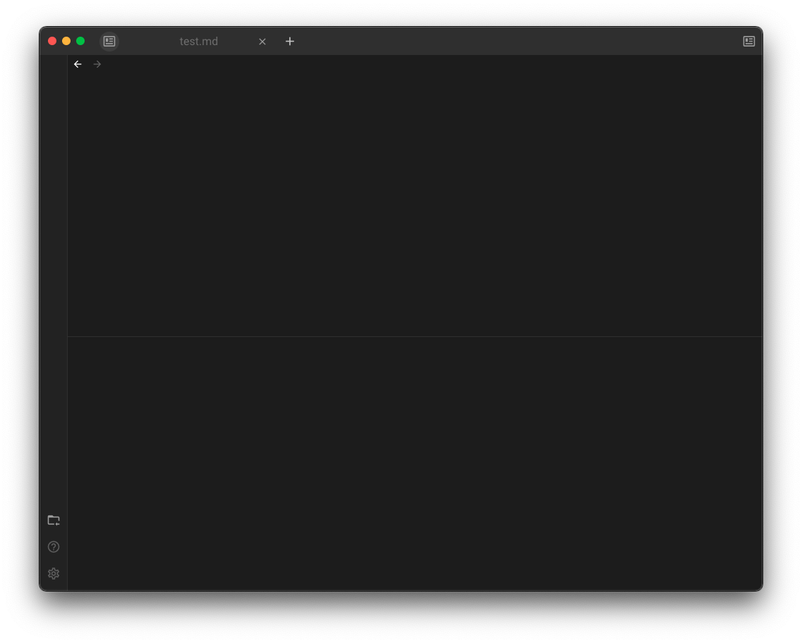

### Future

In the future more buttons and features will be added, such as bookmarks, search queries along with some utility functions.

## QueryBar

### Current

It has 2 parts, a part where you have a list of all the objects in the Vault, 

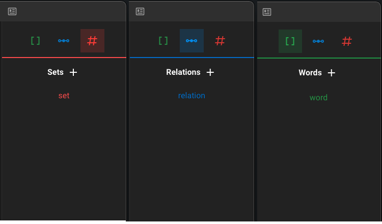

and a quick preview of the currently selected Object, where you can do small edits.

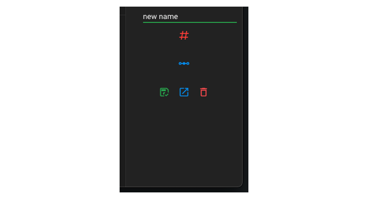

## Sidebar

### Current

This is the left sidebar containing menu items, and a treeview.

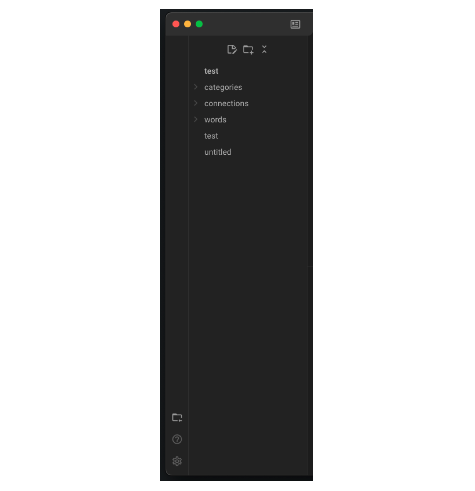

The menu items are basic buttons such as settings, or exiting current vault.

The treeview provides folder structure of the current opened vault. 

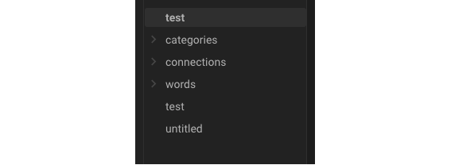

It has a couple buttons for adding folders and files.

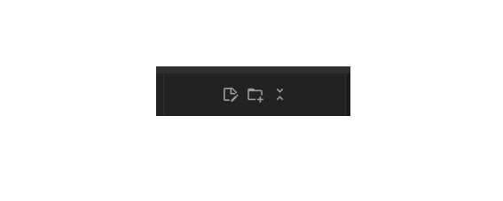

You can rename and move them as you please

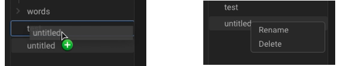 

### Future

More menu items will be added for plugins such as tasks plugins, productivity plugins or programming plugins.

## TextEditor

### Current

Very important part too, and probably the most complex one in terms of coding. This is a Markdown text renderer where it displays the MD rendered as you write.

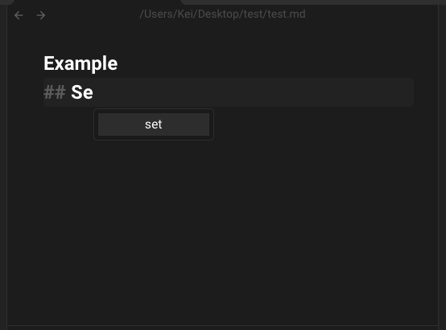

You can also write with our custom syntax Relations and Words, which will be rendered into inline objects.

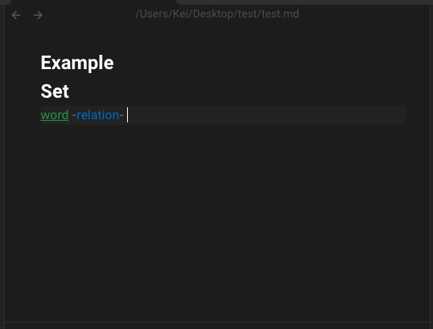

You can click them to select them and view their quick data. It automatically saves so no worries with it deleting suddenly.

### Future

Thanks to its "lines" features, which act as blocks of text we will add new types of blocks, not just text blocks. We will have image blocks, code blocks, tables, embeded websites, graphs ...
The posibilities are really endless

## Other general future additions

In the future you will be able to work in group, in sync. Utility command keys will be added for those who seek optimization and speed. Different design themes will be added for a more pleasing experience. Different APIs will be integrated, so you can work with ChatGPT, or even Telegram Bots. Most of these new features will come in the form of plugins, that will appear in the menu items bar.

